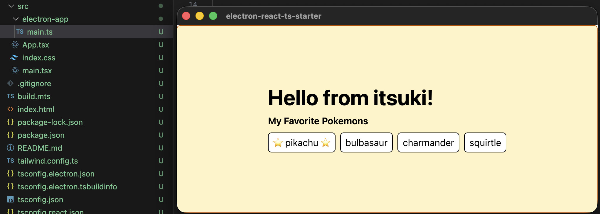

# Electron + React + Typescript + Tailwind Starter App

A skeleton app for using electron/react/typescript and tailwind css to create multi-platform desktop app.

For more details, please refer to my article [Cross-Platform Desktop App with Electron/React/Typescript](https://medium.com/@itsuki.enjoy/cross-platform-desktop-app-with-electron-react-typescript-3a85eaba909a)

## Basic Commands

- `npm run dev` to start the react app listening on `localhost:4444`. Use this to confirm and make changes to UI in real time.
- `npm run build:react` to build the react app
- `npm run build:electron` to build the electron app
- `npm run start` to build the react  app, the elctron app, as well as start the elctron app.

<br>

## Troubleshooting

### `better-sqlite3` compiled against wrong Node version

If you see an error like:
```
Error: The module '.../better-sqlite3/build/Release/better_sqlite3.node'
was compiled against a different Node.js version using NODE_MODULE_VERSION X.
This version of Node.js requires NODE_MODULE_VERSION Y.
```

Rebuild it against Electron's Node version:
```
./node_modules/.bin/electron-rebuild -f -w better-sqlite3
```

### Broken binaries in `node_modules/.bin`

If you see errors like `Cannot find module '.../node_modules/dist/node/cli.js'` or similar, the `.bin` symlinks got corrupted (plain files instead of symlinks). Fix with a clean reinstall:
```
rm -rf node_modules && npm install
```


